# 🚀 PSv — Production-Grade Scalable Fintech Super App (React Native)

A **highly modular, production-grade React Native application** engineered to support **multi-domain fintech workflows** including **Loan Origination (LOS), Collections, Payments, OCR processing, and real-time operations**.

Designed with **scalability, maintainability, and performance at its core**, this project reflects real-world fintech system design patterns used in high-scale applications.

---

## 📱 Demo APK

👉 https://drive.google.com/uc?export=download&id=1MMT6pMfnT08-uBI9knZi2wf0kurNqO07

---

## 📸 Product Walkthrough

### 🧩 Multi-Module Entry & Role-Based Access

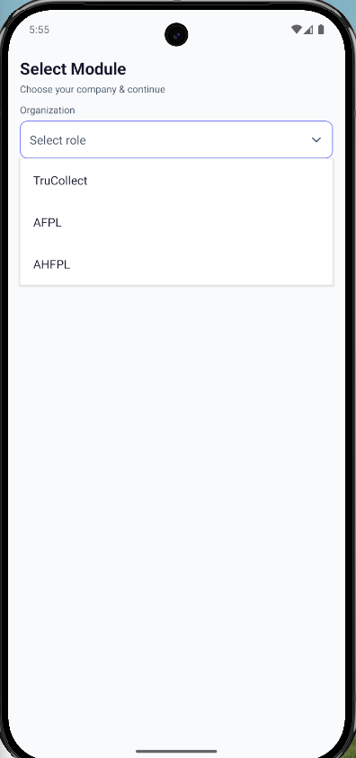
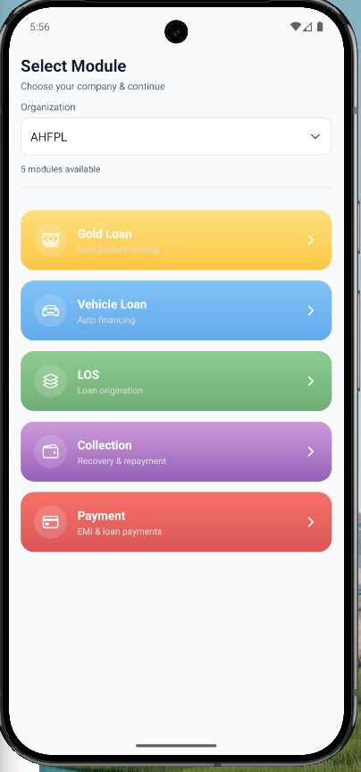

* Dynamic module loading based on **user role**
* Supports **multi-tenant fintech environments**

---

### 🎨 UI System & Theming

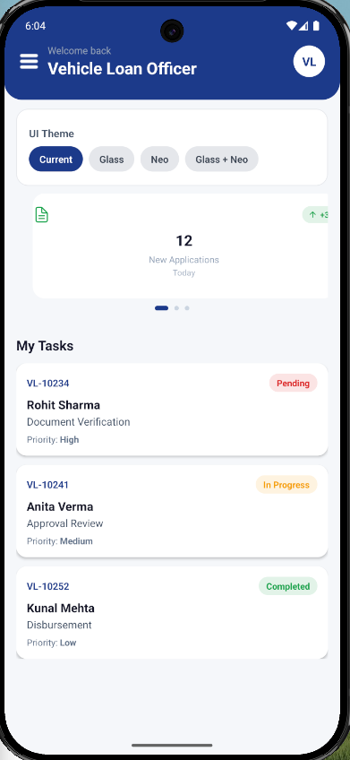

* Centralized design system
* Consistent UI across modules
* Scalable styling strategy

---

### 💰 Loan Systems (LOS + Gold + Vehicle)

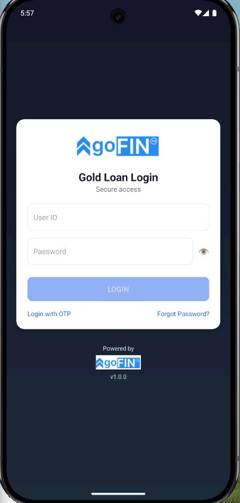
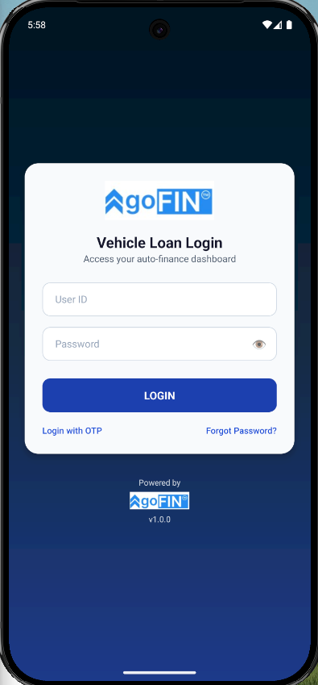

* Loan lifecycle handling
* Form-heavy workflows with validation
* Domain-isolated architecture

---

### 💳 Payments Ecosystem

#### Dashboard & Navigation

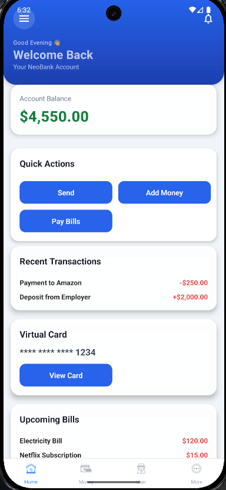
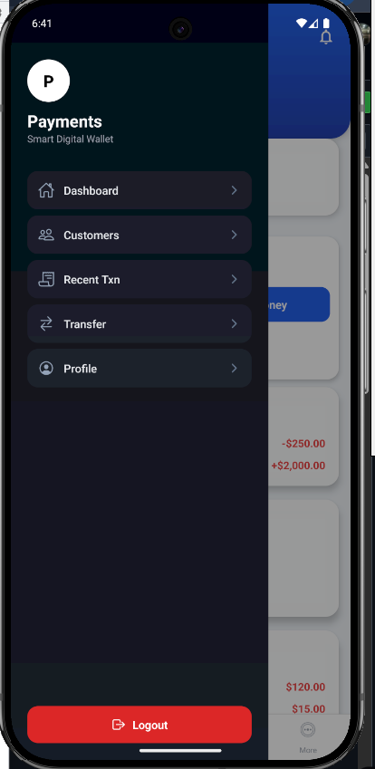

#### Transactions

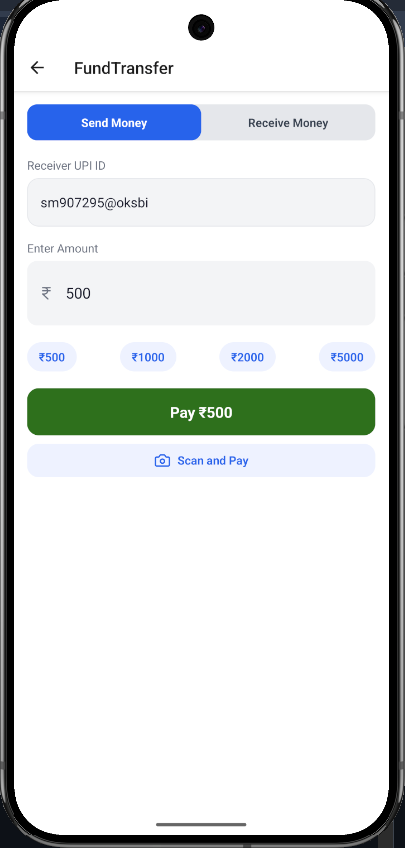
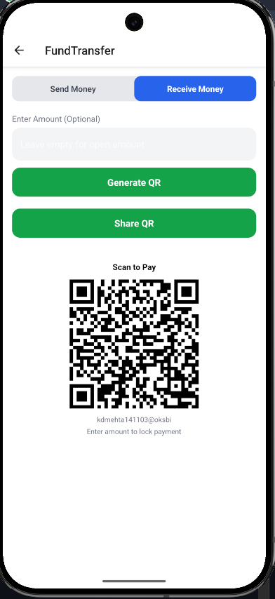

#### Financial Insights

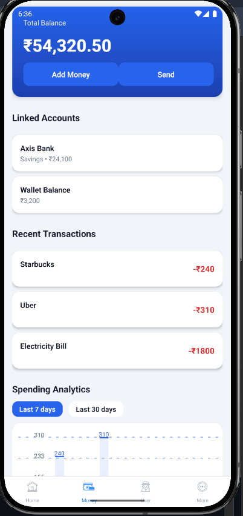

#### Card System

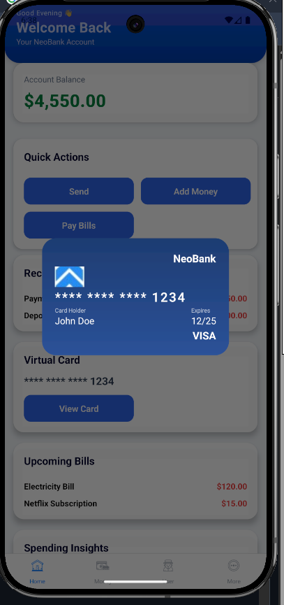
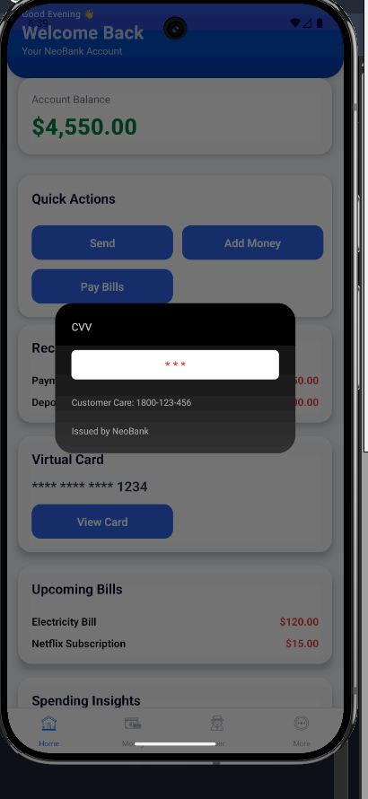

#### User & Settings

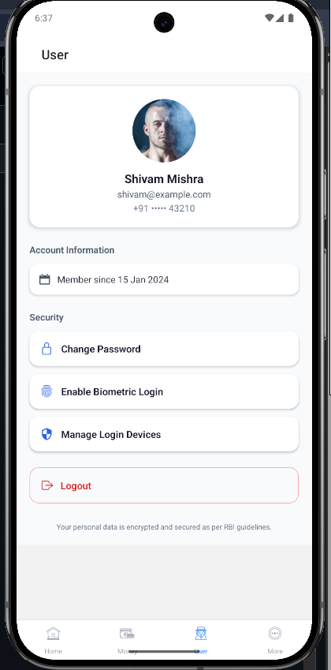
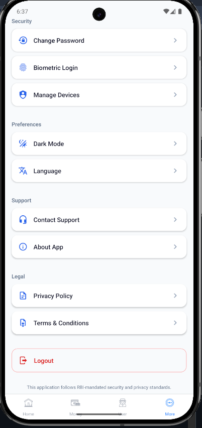

* Modular payment flows
* Transaction handling UI
* Scalable financial dashboard architecture

---

### 📊 Collection & Field Operations

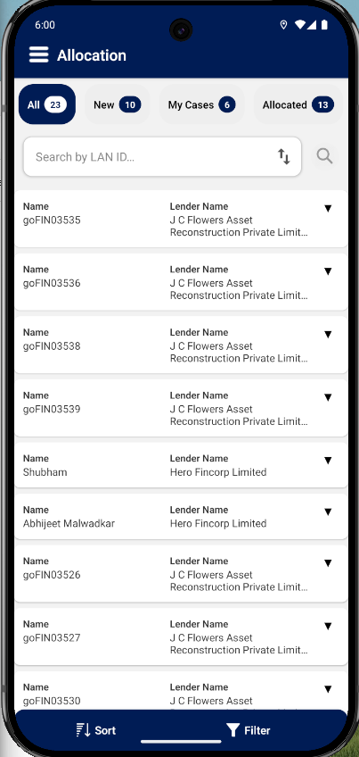
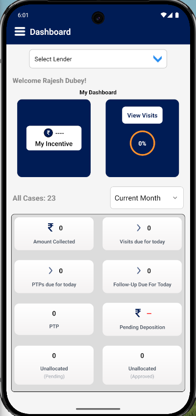
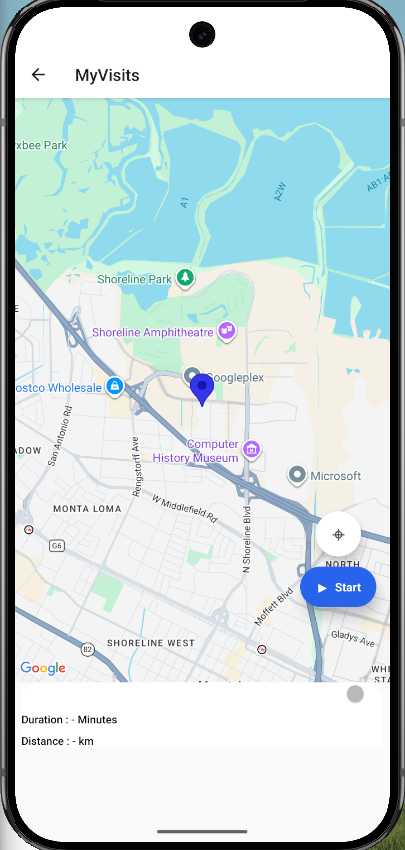

* Agent-based workflows
* Allocation and tracking systems
* Field data handling

---

### 🔍 OCR & Document Processing

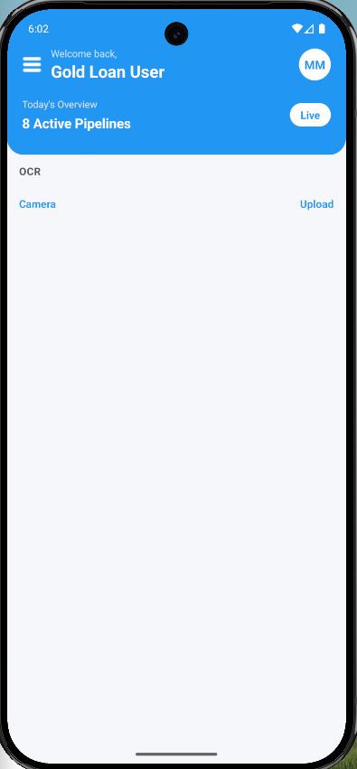

* Camera + file upload integration
* Pre-processing & filtering logic
* Real-world document parsing support

---

### 🧾 Forms & Real-Time Tracking

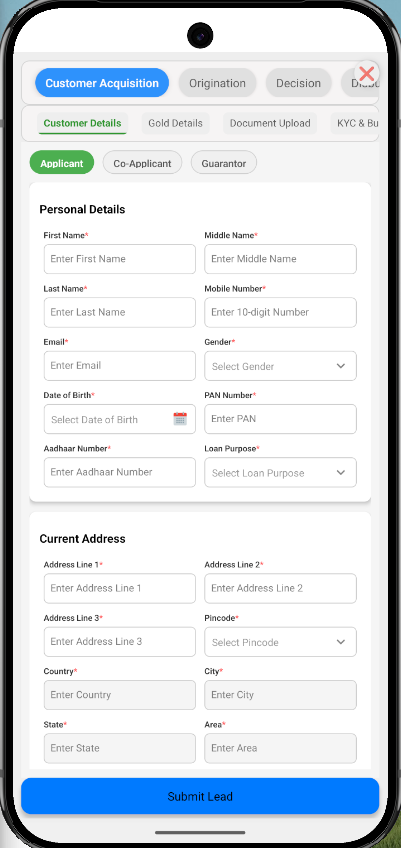
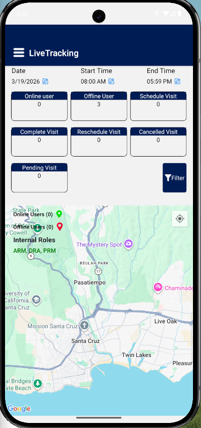

* Complex form state management
* Scalable input handling
* Live operational tracking

---

## 🧠 Core Problem Solved

Traditional fintech apps fail due to:

* Tight coupling between modules
* Poor scalability when adding new features
* Fragmented API handling
* Weak state management strategies

### ✅ This system solves:

* Multi-module scalability using **feature isolation**
* Predictable state with **Redux Toolkit**
* Robust API handling via **centralized interceptors**
* Maintainability through **layered architecture**

---

## 🏗 System Architecture

```
UI Layer (Screens / Components)
        ↓
State Layer (Redux Toolkit)
        ↓
Service Layer (Business Logic)
        ↓
API Layer (Axios Client + Interceptors)
        ↓
Backend Systems
```

---

## ⚙️ Architectural Deep Dive

### 1. Feature-Based Modular Architecture

* Each module (LOS, Payment, Collection) is **self-contained**
* Independent development & deployment capability
* Prevents cross-module regression

---

### 2. Centralized API Layer (Critical Design)

* Single Axios instance
* Request interceptor:

  * Injects auth token
  * Attaches dynamic BASE_URL
* Response interceptor:

  * Handles global errors
  * Captures 401 → triggers logout / refresh flow

---

### 3. Service Layer Abstraction

* Encapsulates all business logic
* Keeps UI layer clean and declarative
* Enables reuse across modules

---

### 4. State Management Strategy

* Redux Toolkit for global state
* Module-level isolation via slices
* Prevents prop drilling and redundant state duplication

---

## ⚡ Performance Engineering

* Memoization (`useMemo`, `useCallback`)
* Component-level optimization (`React.memo`)
* Efficient list rendering (`FlatList` tuning)
* Controlled re-renders via selective Redux subscriptions

---

## 🔐 Security Considerations

* Token-based authentication
* Secure storage via AsyncStorage
* API request protection via interceptors
* Automatic session invalidation on expiry

---

## 📈 Scalability Strategy

* Plug-and-play module system
* Config-driven environments (multi-tenant ready)
* Shared API/service layers
* Minimal cross-module dependencies

---

## 🚨 Real-World Engineering Considerations

### Handling Token Expiry (Advanced Case)

* Centralized interceptor detects 401
* Can be extended to:

  * Queue failed requests
  * Refresh token once
  * Retry all pending requests

---

### Payment Reliability (Idempotency)

* Prevent duplicate transactions using:

  * Unique transaction IDs
  * Backend validation
  * Retry-safe APIs

---

### Large Data Handling (FlatList)

* Virtualization enabled
* Key extraction optimized
* Avoid inline functions in render

---

### Memory Optimization (OCR Images)

* Image compression before upload
* Avoid large base64 payloads
* Controlled rendering lifecycle

---

## 🚀 Getting Started

```bash
npm install
npm start
npm run android
```

---

## 🔧 Tech Stack

* React Native
* Redux Toolkit
* Axios
* AsyncStorage
* React Navigation

---

## ⚠️ Current Limitations

* No offline-first architecture
* No caching layer (React Query missing)
* Token refresh flow not fully optimized
* No automated testing

---

## 🔮 Future Enhancements

* React Query for server-state caching
* Token refresh queue mechanism
* Offline-first support (MMKV / SQLite)
* Unit & integration testing
* Performance monitoring (Flipper, profiling tools)

---

## 👨‍💻 Author

**Shivam Mishra**
React Native Developer (2+ Years Experience)

---

## 💡 Final Note

This project is not just a demo — it reflects **real-world fintech architecture thinking**, focusing on **scalability, modularity, and production-readiness**.
