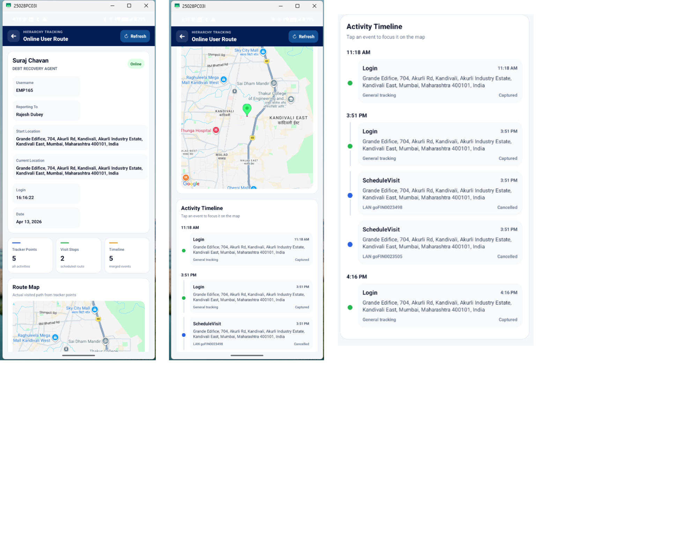
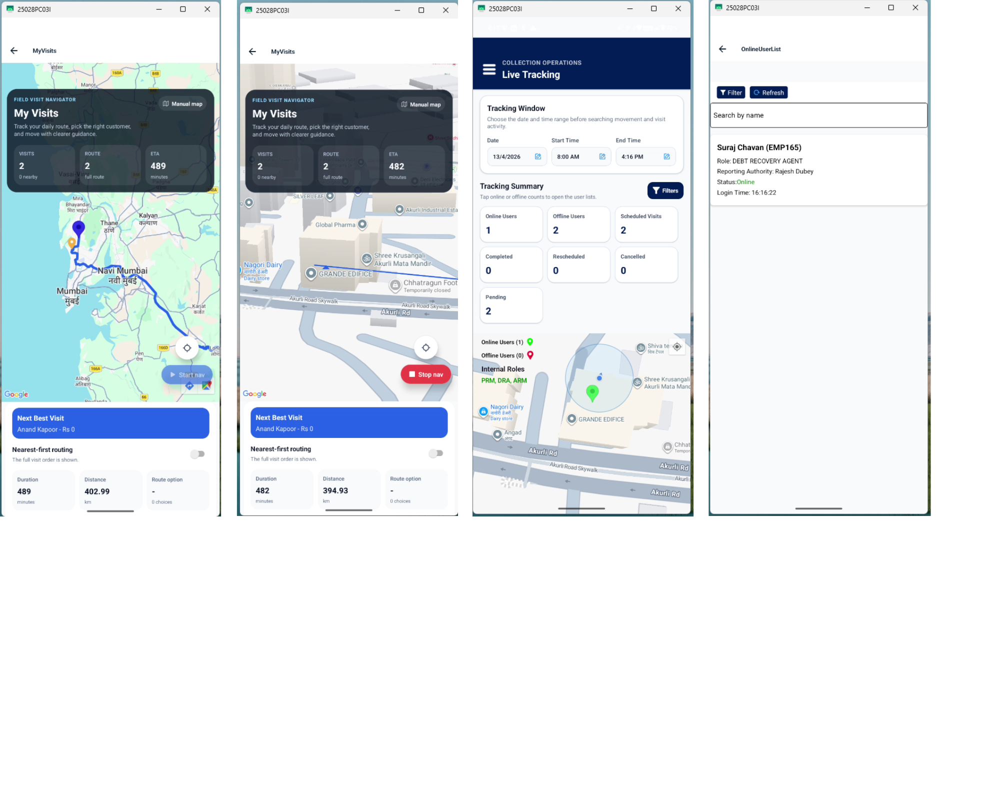
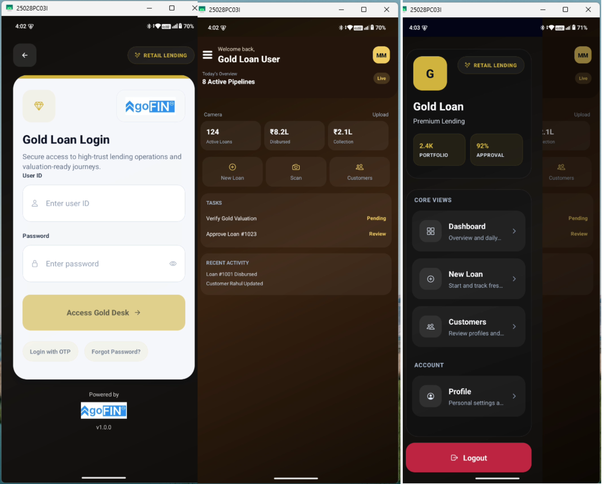
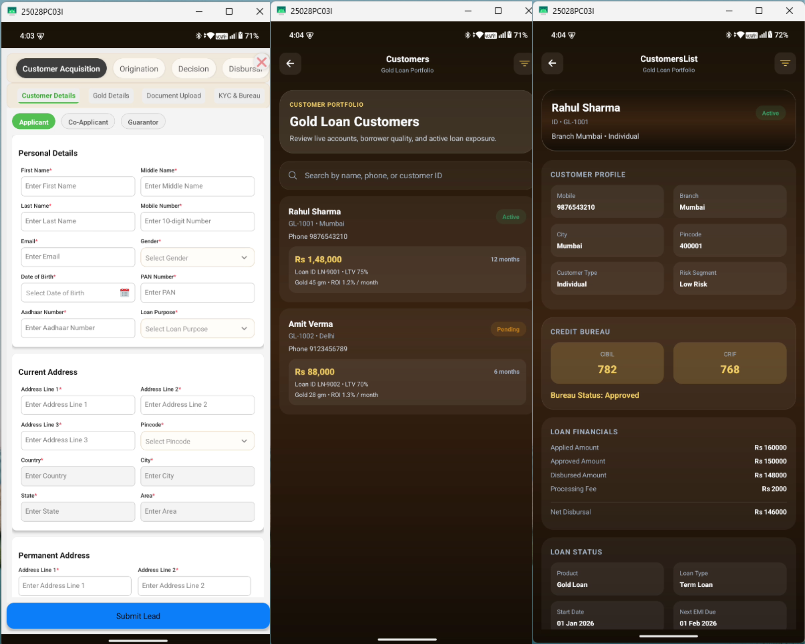
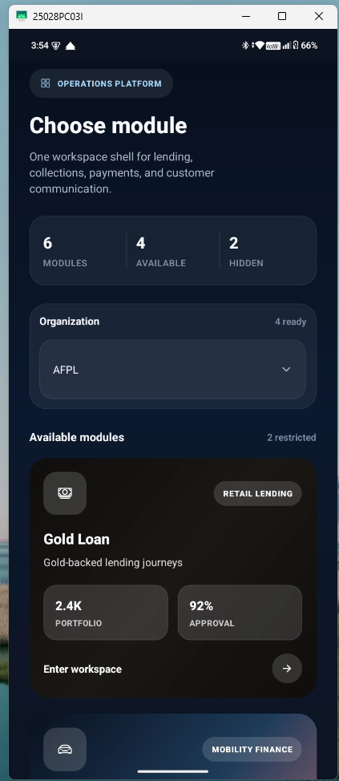
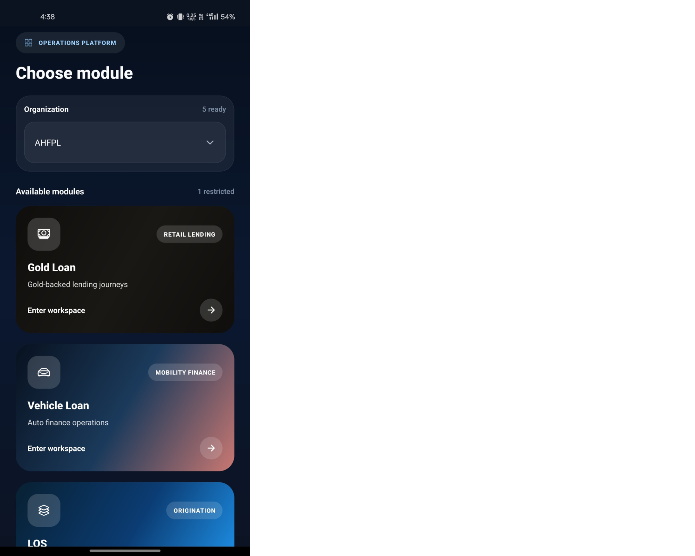
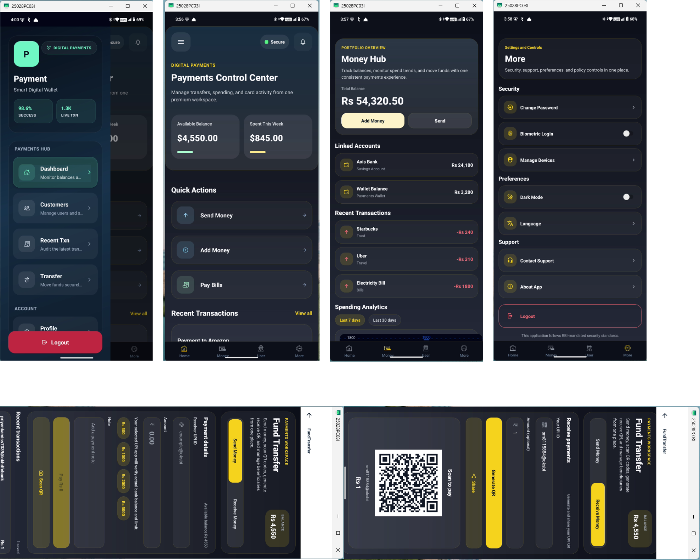
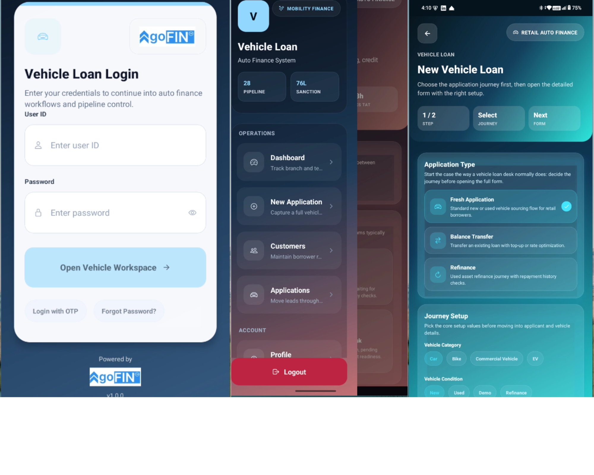
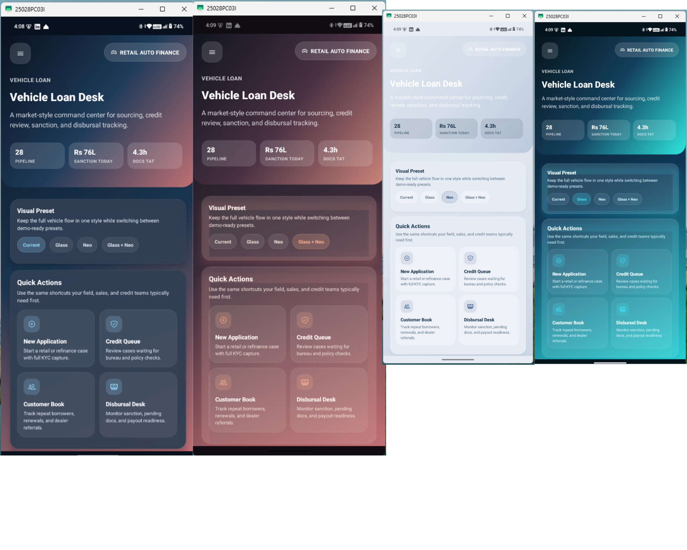
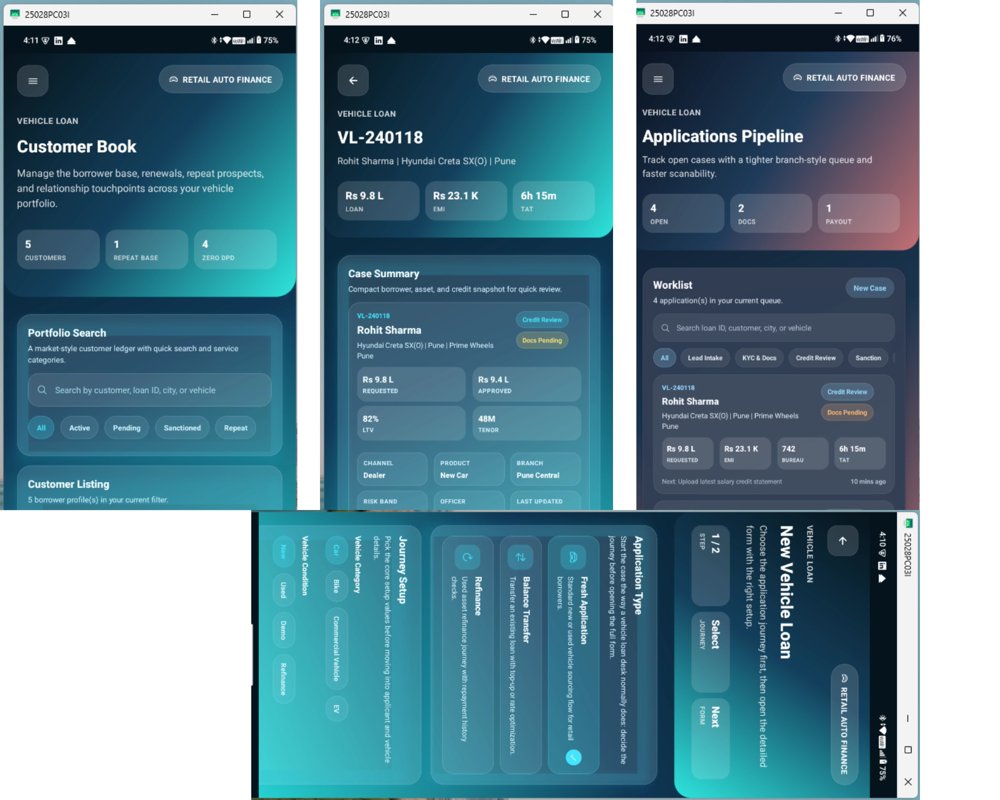

# 🚀 Fintech Mobile Application (React Native)

A **production-grade fintech mobile application** built using React Native, handling real-world workflows like **Loan Origination (LOS), Collections, Payments, OCR, and Live Tracking**.

---

## 🧠 Project Overview

This app is designed with a **scalable modular architecture** and focuses on **performance, reliability, and real-world edge cases** like offline usage and payment safety.

---

## 🎯 Key Features

- 📌 Loan Origination System (LOS)
- 💰 Collections & Payment Integration
- 📍 Real-time Agent Tracking (Map)
- 📷 OCR-based Document Verification
- 📊 Excel-based Auto Form Filling
- 🔔 Push Notifications
- 💬 Real-time Chat Module
- 🔄 Offline-first Sync with Retry Mechanism
- 🔐 Secure API & Token Management

---

## 📸 Screenshots

### 📍 Live Tracking

### 🧩 Module Selection

### 📊 Money Analysis (Gold Loan Dashboard)

### 📋 My Visits / Tracking

### 📷 Customer & Loan Details

### 💰 Loan Profile & Summary

### 🧭 Module Selector (Alt View)

### 🧭 Module Selector (Compact)

### 💳 Payment Dashboard

### 🚗 Vehicle Loan Dashboard

### 🚗 Vehicle Loan Flow

### 🚗 Vehicle Loan Pipeline

---

## ⚙️ Architecture Highlights

- 🧩 Modular Feature-based Architecture  
- 🌐 Centralized API Layer (Axios Interceptors)  
- 🔄 Retry Strategy & Error Handling  
- 📦 Redux Toolkit for State Management  
- ⚡ Performance Optimization (memoization, virtualization)  
- 🔁 Offline Queue System  
- 💳 Idempotent Payment Handling  

---

## 📱 Demo Access

👉 APK available in repository (check files section)

### 🔑 Test Credentials

#### 1️⃣ LOS & Manager Flow
- User: `EMP002`
- Password: `pass@123`

#### 2️⃣ Notifications
- User: `EMP003`
- Password: `pass@123`

#### 3️⃣ Collection & Tracking
- User: `EMP059` / `EMP165`
- Password: `Trub0@rd@123`

#### 4️⃣ Loan & Payment
- Login: Any credentials  
- Includes OCR + Excel auto-fill + Payment  

#### 5️⃣ Chat Module
- Login via mobile/email  

---

## 🧩 Architecture Flow
UI (React Native)
↓
Redux Toolkit
↓
API Layer (Axios + Interceptors)
↓
Backend
↓
Offline Queue (Retry + Sync)

---

## 🛠 Tech Stack

- React Native  
- Redux Toolkit  
- JavaScript (ES6+)  
- Axios / REST APIs  
- React Navigation  
- Android Studio / Xcode  

---

## 💡 Highlights

- Real-world fintech use cases  
- Production-level architecture  
- Offline + retry handling  
- Secure & scalable design  

---

## 👨‍💻 Author

**Shivam Mishra**  
📍 Mumbai  
📞 +91 7506606986  
📧 sm907295@gmail.com  

🔗 GitHub: https://github.com/orionsM21  
🔗 LinkedIn: https://www.linkedin.com/in/shivam-mishra-26577b201  

---

## ⭐ Support

If you like this project, give it a ⭐
